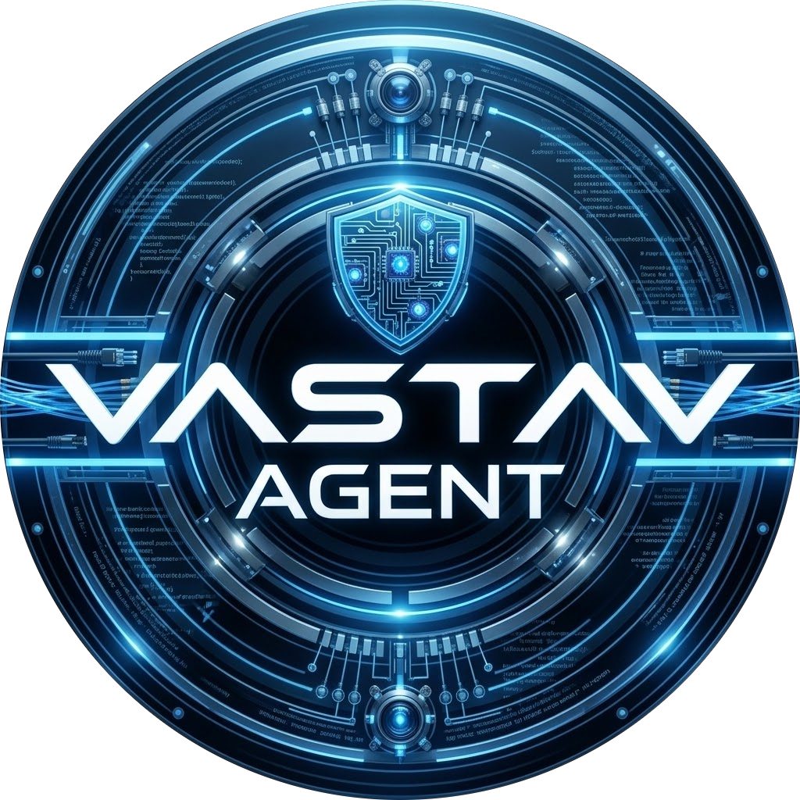
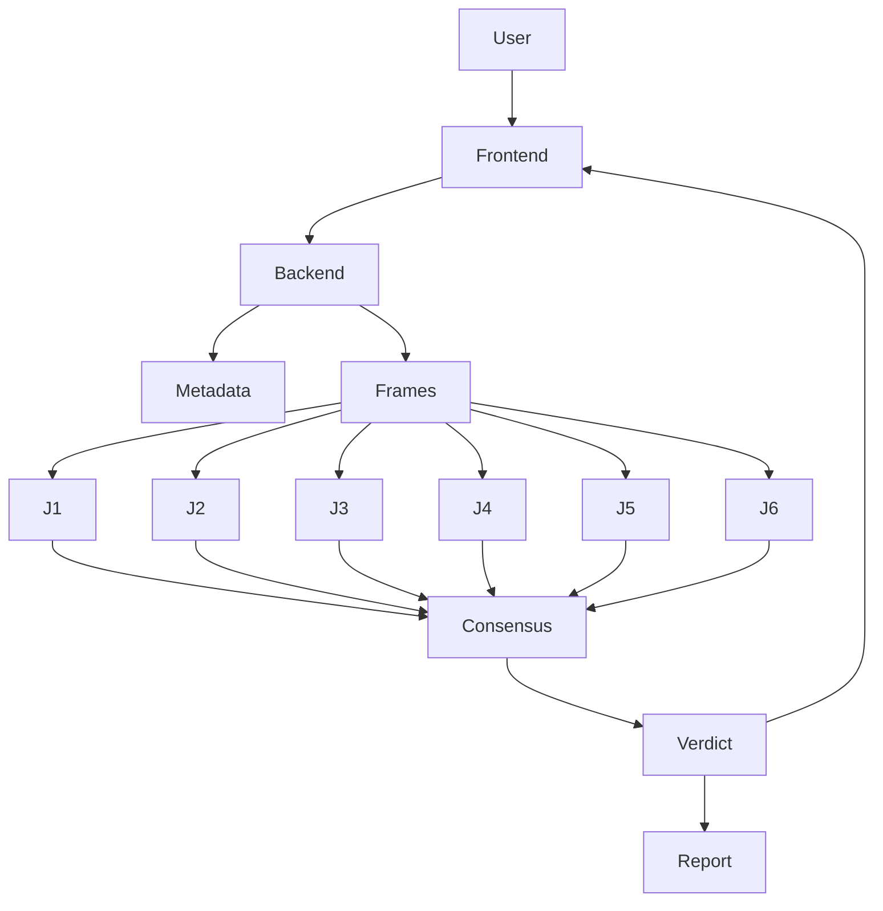

<div align="center">
  

# 👁️ VASTAV AGENT V1.1
### The Elite AI Deepfake & Synthetic Media Detection System

[](https://ai.google.dev/)
[](#)
[](#)

🌐 **Live Demo**  
https://agent.ekoahamdutivnasti.com

💻 **Source Code**  
https://github.com/IMAKEAI789456/project-x91a-core-engine

*Built by Navneet Singh — Ekoahamdutivnasti Technologies*  
`#GeminiLiveAgentChallenge`

</div>

---

# ⚡ What is VASTAV AGENT?

**VASTAV** *(Validation & Authentication System for Truth And Verification)* is a multi-agent artificial intelligence system designed to combat synthetic media and deepfakes.

Instead of relying on a **single AI model**, VASTAV uses a **multi-judge AI ensemble** powered by **Google Gemini**.

When a user uploads media:

1️⃣ Frames and metadata are extracted  
2️⃣ Six independent AI judges analyze the media  
3️⃣ Each judge produces reasoning  
4️⃣ A consensus engine calculates the final verdict  

This architecture dramatically improves **reliability and explainability**.

---

# 📸 Demo Preview

Upload media → AI judges analyze → consensus verdict → forensic report.

The system supports:

- Images
- Videos
- EXIF metadata inspection
- AI artifact detection
- physics consistency checks

---

# ⚖️ The 6-Judge AI Ensemble

| Judge | Specialty | Focus |
|------|-----------|------|
| 🔍 | **Forensic Analyst** | Lighting, reflections, sub-surface scattering |
| 🧬 | **Artifacts & Patterns** | GAN signatures, diffusion artifacts |
| 🧠 | **Contextual Analyzer** | Semantic logic & spatial relationships |
| 🧲 | **Physics Engine** | Gravity, materials, physical realism |
| 👑 | **Chief Justice** | Holistic cross-analysis |
| 🛡️ | **SynthID Detector** | Google SynthID watermark detection |

---

# 🧠 How Consensus Works

Each judge produces:

```
{
  verdict: "REAL | FAKE",
  confidence: number,
  reasoning: string
}
```

The **consensus engine** calculates:

```
Final Verdict = Majority Vote ( ≥4 / 6 )
Confidence = Weighted Average
```

This prevents **single-model failure**.

---

# 🏗️ Architecture



---

# 🚀 Key Features

- 🧠 **Multi-Agent AI Detection**
- ⚡ **Parallel Processing**
- 📊 **Consensus-Based Verdict**
- 📄 **Forensic Intelligence Reports**
- 🎥 **Video Frame Analysis**
- 🔍 **Metadata Inspection**
- 🛡️ **SynthID Detection**

---

# 🛠️ Tech Stack

### AI & Agents
- Google Gemini
- Google ADK (Agent Development Kit)

### Frontend
- React
- TailwindCSS
- Framer Motion
- Shadcn UI

### Backend
- Node.js
- Express
- TypeScript

### Media Processing
- FFmpeg
- EXIF Reader

### Reporting
- Puppeteer
- PDFKit

### Deployment
- Google Cloud Run

---

# 🧪 Local Setup

### Clone Repository

```bash
git clone https://github.com/IMAKEAI789456/project-x91a-core-engine.git
cd project-x91a-core-engine
```

### Install Dependencies

```bash
npm install
```

### Configure Environment

Create `.env`

```
GOOGLE_API_KEY=your_api_key
PORT=3100
```

### Start Server

```
npm start
```

Open:

```
http://localhost:3100
```

---

# ☁️ Deployment

The system is designed for **container-based deployment**.

Recommended platforms:

- Google Cloud Run
- Render
- Railway

Ensure Chromium dependencies exist for Puppeteer.

---

# 📊 Example Report

Each scan produces a **forensic intelligence report** containing:

- individual judge verdicts
- confidence levels
- reasoning explanations
- final consensus decision

---

# 🔒 Security & Privacy

- No media stored permanently
- Stateless analysis
- Metadata sanitized
- AI inference logs isolated

---

# 👨‍💻 Author

**Navneet Singh**  
Founder — Ekoahamdutivnasti Technologies

AI Engineer | Cybersecurity Researcher | Builder

---

<div align="center">

**Built for the Google Gemini Live Agent Challenge 2026**

*"In an era of synthetic reality, trust requires multi-agent verification."*

</div>
