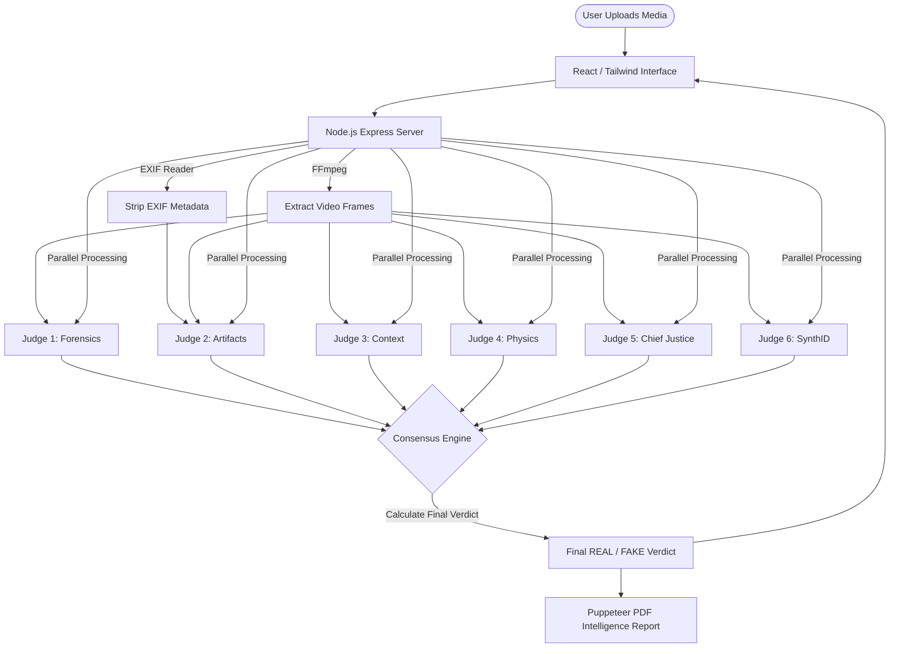

<div align="center">
  

# 👁️ VASTAV AGENT V4.0
### The Elite AI Deepfake & Synthetic Media Detection System

[](https://ai.google.dev/)
[](#)
[](#)

🌐 **Live Demo**
[https://agent.ekoahamdutivnasti.com](https://agent.ekoahamdutivnasti.com)

💻 **Source Code**
[https://github.com/IMAKEAI789456/project-x91a-core-engine](https://github.com/IMAKEAI789456/project-x91a-core-engine)

*Built by Navneet Singh — Ekoahamdutivnasti Technologies*
`#GeminiLiveAgentChallenge`

</div>

---

## ⚡ What is VASTAV AGENT?

**VASTAV** *(Validation & Authentication System for Truth And Verification)* is a state-of-the-art, multi-agent artificial intelligence system designed to combat the rising tide of synthetic media, deepfakes, and AI-generated hallucinations.

Instead of relying on a **single detection algorithm**, VASTAV deploys a **Multi-Judge AI Ensemble** powered by **Google Gemini 2.5 Flash Lite**. When a user uploads an image or video:

1️⃣ Raw data, visual frames, and hidden EXIF metadata are extracted  
2️⃣ Six independent AI "Judges" analyze the media in parallel  
3️⃣ Each judge produces a verdict with reasoning and confidence score  
4️⃣ A consensus engine calculates the final mathematically-weighted decision  

This architecture dramatically improves **reliability and explainability** compared to single-model detection.

---

## ⚖️ The 6-Judge AI Ensemble

| Judge | Name / Specialty | Focus Area |
| :---: | :--- | :--- |
| 🔍 | **JUDGE 1: Forensic Analyst** | Lighting, shadows, reflections, and sub-surface scattering |
| 🧬 | **JUDGE 2: Artifacts & Patterns** | GAN signatures, diffusion markers, missing EXIF, synthetic textures |
| 🧠 | **JUDGE 3: Contextual Analyzer** | Semantic logic, cultural anomalies, impossible anatomy, spatial relationships |
| 🧲 | **JUDGE 4: Physics Engine** | Gravity, material tension, fabric folding, fluid dynamics |
| 👑 | **JUDGE 5: Chief Justice** | Macro-level coherence and psychological intent |
| 🛡️ | **JUDGE 6: SynthID Detector** | Google SynthID watermarks and metadata footprints |

---

## 🧠 How Consensus Works

Each judge produces:

```json
{
  "verdict": "REAL | FAKE",
  "confidence": 0.0,
  "reasoning": "string"
}
```

The **consensus engine** calculates:

```
Final Verdict = Majority Vote ( ≥ 4 / 6 judges )
Confidence    = Weighted Average of all judge scores
```

This prevents **single-model failure** and ensures explainable, auditable results.

---

## 🏗️ Architecture



---

## 🚀 Key Features

- 🧠 **Multi-Agent AI Detection** — 6 specialized Gemini judges in parallel
- ⚡ **Parallel Processing** — all judges run simultaneously for speed
- 📊 **Consensus-Based Verdict** — majority vote prevents single-model failure
- 📄 **Forensic Intelligence Reports** — downloadable PDF per scan
- 🎥 **Video Frame Analysis** — FFmpeg-powered frame extraction
- 🔍 **EXIF Metadata Inspection** — detects missing or forged metadata
- 🛡️ **SynthID Detection** — specialized Google watermark scanning

---

## 🛠️ Tech Stack

| Layer | Technology |
| :--- | :--- |
| **AI / Agents** | Google Gemini 2.5 Flash Lite, Google ADK |
| **Frontend** | React, Tailwind CSS, Framer Motion, Recharts, Lucide Icons |
| **Backend** | Node.js, Express, TypeScript, Multer |
| **Media Processing** | FFmpeg (video frames), Exif-Reader (metadata) |
| **Reporting** | Puppeteer (HTML → PDF), PDFKit |
| **Deployment** | Google Cloud Run |

---

## 🧪 Spin-Up Instructions

> **Devpost Requirement:** Follow these steps to run VASTAV AGENT locally or deploy it to the cloud.

### Option A: Run Locally (Node.js)

**1. Clone the repository**
```bash
git clone https://github.com/IMAKEAI789456/project-x91a-core-engine.git
cd project-x91a-core-engine
```

**2. Install dependencies**
```bash
npm install
```

**3. Configure environment variables**

Create a `.env` file in the root directory:
```bash
cp .env.example .env
```

Then open `.env` and add your **Google AI Studio API Key**:
```env
GOOGLE_API_KEY=your_api_key_here
PORT=3100
```

**4. Start the server**
```bash
npm start
```

Open your browser at:
```
http://localhost:3100
```

---

### Option B: Run Locally (Docker)

**1. Build the Docker image**
```bash
docker build -t vastav-agent .
```

**2. Run the container**
```bash
docker run -p 3100:3100 --env-file .env vastav-agent
```

Open your browser at:
```
http://localhost:3100
```

> **Note:** The `Dockerfile` installs all necessary Chromium/Puppeteer dependencies for PDF report generation automatically.

---

### Option C: Deploy to Google Cloud Run

**1. Authenticate with Google Cloud**
```bash
gcloud auth login
gcloud config set project YOUR_PROJECT_ID
```

**2. Build and push the Docker image**
```bash
gcloud builds submit --tag gcr.io/YOUR_PROJECT_ID/vastav-agent
```

**3. Deploy to Cloud Run**
```bash
gcloud run deploy vastav-agent \
  --image gcr.io/YOUR_PROJECT_ID/vastav-agent \
  --platform managed \
  --region us-central1 \
  --allow-unauthenticated \
  --set-env-vars GOOGLE_API_KEY=your_api_key_here \
  --port 3100
```

**4. Access your live URL**

Cloud Run will output a live HTTPS URL upon successful deployment.

> 🌐 **Live deployment:** [https://agent.ekoahamdutivnasti.com](https://agent.ekoahamdutivnasti.com)

---

### Option D: Deploy to Render / Railway

1. Connect your GitHub repository to your Render or Railway dashboard.
2. Add `GOOGLE_API_KEY` in your project's Environment Variables settings.
3. The platform auto-detects the `Dockerfile` and builds the container.
4. Set Health Check path to `/` and Port to `3100`.
5. Deploy and access your live URL.

---

## 📊 Example Report Output

Each scan generates a **Forensic Intelligence Report** containing:

- Individual judge verdicts with confidence scores
- Detailed reasoning from each judge
- Weighted consensus decision
- EXIF metadata summary
- Final `REAL` / `FAKE` classification

---

## 🔒 Security & Privacy

- No media stored permanently after analysis
- Stateless, ephemeral inference pipeline
- EXIF metadata sanitized before processing
- AI inference logs isolated per request

---

## 👨‍💻 Author

**Navneet Singh**
Founder — Ekoahamdutivnasti Technologies
AI Engineer | Cybersecurity Researcher | Builder

---

<div align="center">

**Built for the Google Gemini Live Agent Challenge 2026**

*"In an era of synthetic reality, trust requires multi-agent verification."*

</div>
