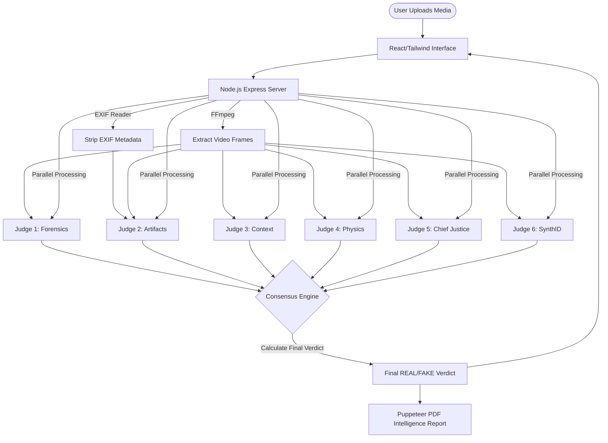

<div align="center">
  
  
  # 👁️ VASTAV AGENT V4.0
  **The Elite AI Deepfake & Synthetic Media Detection System**

  [](https://ai.google.dev/)
  [](#)
  [](#)

  [**Live Demo (Placeholder)**](https://your-demo-url-here.com) | [**Report a Bug**](#)

  *Built by Navneet Singh, Ekoahamdutivnasti Technologies*  
  `#GeminiLiveAgentChallenge`
</div>

---

## ⚡ What is VASTAV AGENT?

**VASTAV** (Validation & Authentication System for Truth And Verification) is a state-of-the-art, multi-agent artificial intelligence system designed to combat the rising tide of synthetic media, deepfakes, and AI-generated hallucinations.

Instead of relying on a single detection algorithm, VASTAV deploys a **Multi-Judge AI Ensemble** powered by **Google Gemini 2.5 Flash Lite**. When a user uploads an image or video, the raw data, visual frames, and hidden EXIF metadata are instantly fed into six specialized AI "Judges" operating in parallel, culminating in a mathematically weighted consensus verdict.

---

## ⚖️ The 6-Judge AI Ensemble

Our unique architecture guarantees high accuracy by assigning specialized domains of expertise to independent AI agents before merging their findings:

| Judge | Name / Specialty | Focus Area |
| :---: | :--- | :--- |
| 🔍 | **JUDGE 1: Forensic Analyst** | Analyzes lighting, shadows, reflections, and sub-surface scattering. |
| 🧬 | **JUDGE 2: Artifacts & Patterns** | Detects GAN signatures, diffusion markers, missing metadata (EXIF), and synthetic textures. |
| 🧠 | **JUDGE 3: Contextual Analyzer** | Reviews semantic logic, cultural anomalies, impossible anatomy, and spatial relationships. |
| 🧲 | **JUDGE 4: Physics Engine** | Analyzes gravity, material tension, fabric folding, and fluid dynamics. |
| 👑 | **JUDGE 5: Chief Justice** | Macro-level overseer that evaluates high-level coherence and psychological intent. |
| 🛡️ | **JUDGE 6: SynthID Detector** | Specialized agent tailored to search for Google SynthID watermarks and metadata footprints. |

---

## 🏗️ Architecture Overview



---

## 🛠️ Tech Stack

- **AI Model:** Google Gemini 2.5 Flash Lite API (Multi-agent orchestrated)
- **Frontend:** React, Tailwind CSS, Framer Motion, Recharts, Lucide Icons
- **Backend:** Node.js, Express, TypeScript, Multer (Handles multipart parsing)
- **Media Processing:** FFmpeg (Video frame extraction), Exif-Reader (Metadata analysis)
- **Reporting:** Puppeteer (HTML-to-PDF generation engine)

---

## 🚀 Setup & Local Execution

Follow these steps to deploy the VASTAV AI Ensemble on your local machine:

**1. Clone the repository**
```bash
git clone https://github.com/IMAKEAI789456/project-x91a-core-engine.git
cd vastav-agent
```

**2. Install dependencies**
```bash
npm install
```

**3. Set up Environment Variables**  
Create a `.env` file in the root directory and add the required variables (see below).

**4. Start the server**
```bash
npm start
```
The application will launch its matrix-style terminal on the backend and become available in your browser at `http://localhost:3100`.

---

## 🔑 Environment Variables

To run this project, you will need to add the following environment variables to your `.env` file:

```env
# Your Google AI Studio API Key
GOOGLE_API_KEY="your_api_key_here"

# (Optional) Port configuration
PORT=3100 
```

---

## 🌐 How to Deploy

To deploy VASTAV Agent to production:

1. **Pre-build step:** Ensure you compile the TypeScript configuration or use a runner like `tsx` for production environments.
2. **Platform:** The App is stateless and designed perfectly for platforms like **Render**, **Railway**, or **Google Cloud Run**.
3. **Puppeteer Dependencies:** If deploying on Linux servers, ensure Chrome/Chromium dependencies are installed via your Dockerfile, as Puppeteer requires a browser runtime to generate the PDF Intelligence Reports.

---

<div align="center">
  <p><b>Built for the Google Gemini Live Agent Challenge 2026</b></p>
  <i>"In an era of synthetic reality, trust requires multi-agent verification."</i>
</div>
